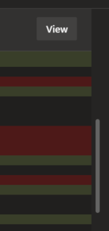
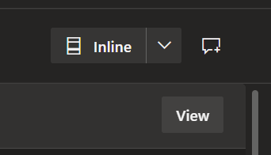
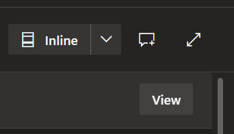

# Azure DevOps PR View #

Chrome browser plugin which improves the Azure DevOps pull request (PR) view to make code reviews easier

## Features ##

### Single Scrollbar ###
Removes the scrollbars on individual files when viewing the files in a PR

Before

After

### Commit Full Screen Toggle ###
Adds a button to view in full screen mode when viewing a single commit. Operates similar to the full screen mode when viewing the files in a PR. Keyboard shortcut "z" is also supported.

Before

After

