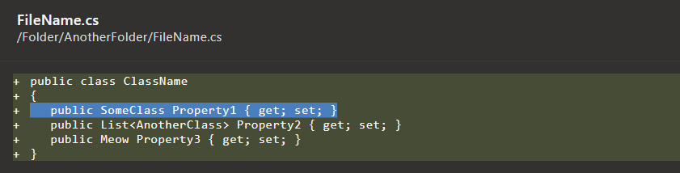
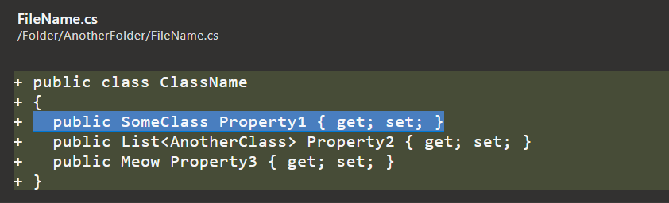
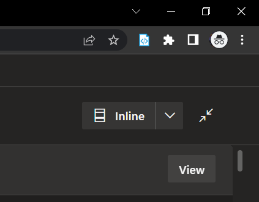
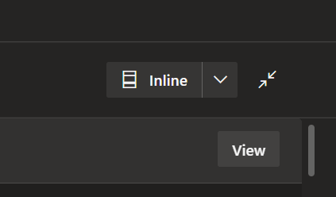
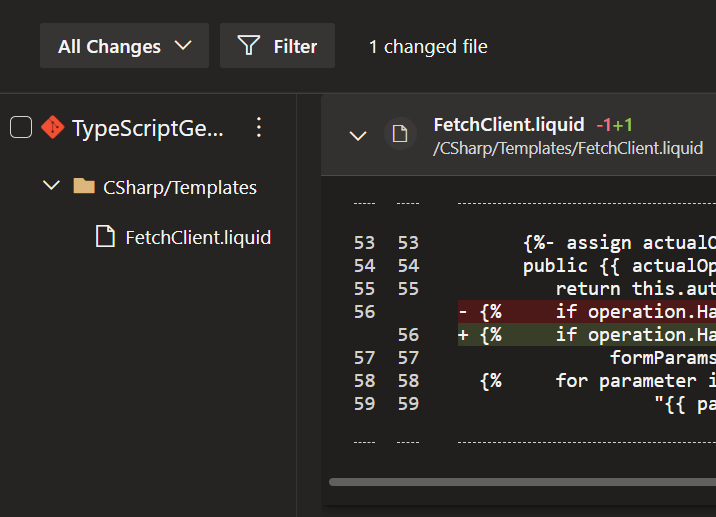
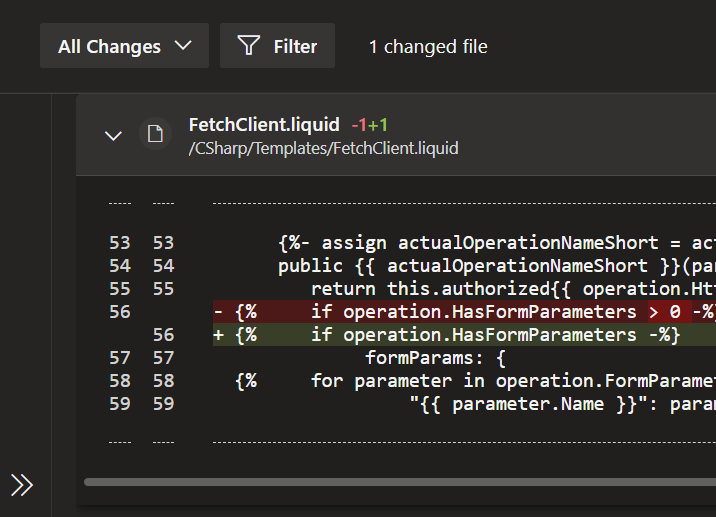
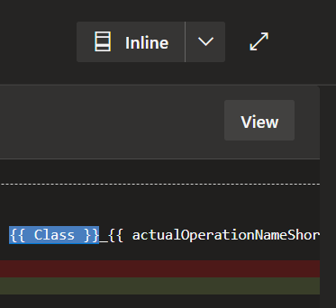
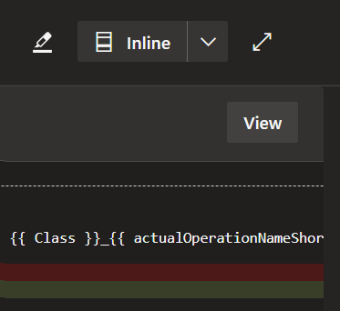
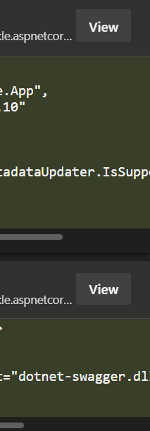
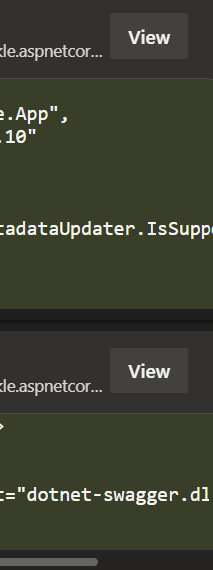

# Azure DevOps PR View #

Chrome browser extension which improves the Azure DevOps pull request (PR) view to make code reviews easier

## Features ##

All of the below features can be enabled/disabled via the extension's options page

### Additional Full Screen Toggle Buttons ###
Adds a button to view in full screen mode when viewing a single commit and when creating a new PR. Operates similar to the full screen mode when viewing the files in a PR. Keyboard shortcut 'z' is also supported.

Before

After

### Code Zoom ###
Enables changing the zoom of code blocks by using ctrl + mouse wheel or manually via the options page and remembers the zoom level between sessions

Before

After

### True Full Screen ###
Toggles the browser's full screen mode when full screen mode is toggled via a button or the keyboard shortcut 'z'

Before

After

### Collapse Left Panel on Full Screen ###
Collapses/expands the left panel when full screen mode is toggled via a button or the keyboard shortcut 'z'

Before

After

### Comment Highlight Toggle ###
Adds a button that toggles the visibility of code comment highlights and remembers the visibility between sessions

Before

After

### Single Horizontal Scrollbar ###
Removes the horizontal scrollbars on individual files when viewing the files in a PR. Side-by-side view is not affected.

Before

After

## FAQ ##

What happened to "Single Vertical Scrollbar"?

This is now the default behaviour of Azure DevOps, so it's no longer required

## Feedback ##

[Submit](https://bitbucket.org/unimorphic/azuredevopsprview/issues/new) bug reports and other feedback in the [issues](https://bitbucket.org/unimorphic/azuredevopsprview/issues?status=new&status=open) section

## License ##

MIT
