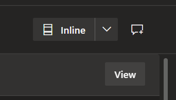

# Azure DevOps PR View #

Chrome browser extension which improves the Azure DevOps pull request (PR) view to make code reviews easier

## Features ##

All of the below features can be enabled/disabled via the extension's options page

### Single Vertical Scrollbar ###
Removes the vertical scrollbars on individual files when viewing the files in a PR

Before

After

### Additional Full Screen Toggle Buttons ###
Adds a button to view in full screen mode when viewing a single commit and when creating a new PR. Operates similar to the full screen mode when viewing the files in a PR. Keyboard shortcut 'z' is also supported.

Before

After

## Feedback ##

[Submit](https://bitbucket.org/unimorphic/azuredevopsprview/issues/new) bug reports and other feedback in the [issues](https://bitbucket.org/unimorphic/azuredevopsprview/issues?status=new&status=open) section

## License ##

MIT
